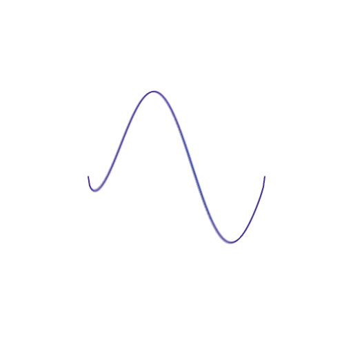

# Raul Esteban Alzate Aristizabal 

### Ingeniero Electronico y de Telecomunicaciones - Universidad Autonoma de Occidente 
### Estudiante de Maestria en Ingenieria Fisica - Universidad Nacional de Colombia sede Medellin

</a> 
  
  

 
  
  
  
  

  
  
  
  
  

  
  
          
  
  
          
  
  

