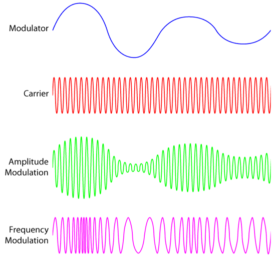

  <H1>Raul Esteban Alzate Aristizabal</H1>
  <H3>Ingeniero Electronico y de Telecomunicaciones - Universidad Autonoma de Occidente </H3>
  <H3>Estudiante de Maestria en Ingenieria Fisica - Universidad Nacional de Colombia sede Medellin</H3>

  

  

<!--

  

    
    
    
  

  
-->

---

  
  
  
  
            

 

  
  
  

  
  
  
  
  

 
 
 
 
 
 
</a>
